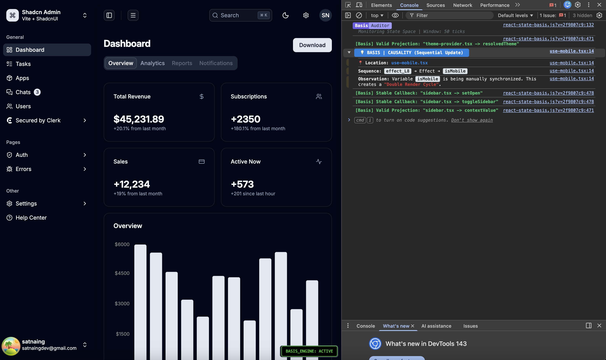

<p align="center">
  
</p>

<div align="center">

# 📐 REACT-STATE-BASIS
### **Behavioral State Analysis for React**

[](https://www.npmjs.com/package/react-state-basis)
[](https://github.com/liovic/react-state-basis/stargazers)
[](https://opensource.org/licenses/MIT)

</div>

---

### The Core Concept
In Linear Algebra, a **Basis** is a set of linearly independent vectors that span a space. **Basis** treats your React application as a dynamic system where every state variable is a signal over time.

If two states always update in lockstep, they are **linearly dependent** (redundant). Basis detects these "Dimension Collapses" at runtime and suggests refactoring to derived state (`useMemo`).

---

## How it Works: The Vectorization Engine

Basis doesn't care about the *values* of your state. It monitors the **topology of transitions**.

### 1. The System Tick
The engine groups all state updates occurring within a **20ms window** (aligned with the 60FPS frame budget) into a single **System Tick**.

### 2. State-to-Vector Mapping
Every hook is mapped to a vector $v$ in a 50-dimensional space $\mathbb{R}^{50}$ representing a sliding window of the last 50 ticks:
*   `1` = State transition occurred during this tick.
*   `0` = State remained stagnant.

**Example of two redundant (collinear) states:**
```text
State A: [0, 1, 0, 0, 1, 0, 1, 0, 1, 0]  <-- vA
State B: [0, 1, 0, 0, 1, 0, 1, 0, 1, 0]  <-- vB
Result:  Cosine Similarity = 1.00 (REDUNDANT)
```

Basis detects synchronization, not identity. Even if the data inside the hooks is different, if they always change at the same time, they are collinear in the state-space."

### 3. Real-time Auditing
Every 5 ticks, Basis calculates the **Cosine Similarity** between all active state vectors. If similarity exceeds **0.88**, an architectural alert is triggered in your console with a suggested fix.

---

## Ghost Mode: Zero-Overhead Production
Basis is a **development-only** infrastructure. Using **Conditional Exports**, it automatically swaps itself for a "Zero-Op" version in production:
*   **Development:** Full Linear Algebra engine and auditor active.
*   **Production:** Exports raw React hooks directly. **Zero bundle bloat. Zero performance penalty.**

---

## Quick Start

### 1. Install
```bash
npm i react-state-basis
```

### 2. Initialize
```tsx
import { BasisProvider } from 'react-state-basis';

export default function Root() {
  return (
    <BasisProvider debug={true}> {/* Set debug={false} for total silence in dev */}
       <App />
    </BasisProvider>
  );
}
```
**Props:**
*   `debug (boolean)`: 
    *   `true` (Default): Enables the real-time diagnostic dashboard, visual system status badge (Web only), and detailed console auditing (including the Circuit Breaker).
    *   `false`: Completely deactivates the Basis engine. No background analysis, no memory consumption, and no logging. The "Circuit Breaker" is also disabled in this mode to allow for a zero-overhead, raw React experience in development.

### 3. Drop-in Replacement
Replace your standard React hook imports with `react-state-basis`. This allows the engine to instrument your state updates without changing your component logic.

**Standard Named Imports (Recommended):**
```tsx
// ❌ Change this:
// import { useState, useEffect } from 'react';

// ✅ To this:
import { 
  useState, 
  useEffect, 
  useMemo, 
  useCallback,
  useContext, 
  useRef, 
  useLayoutEffect, 
  useId, 
  useSyncExternalStore,
  useDeferredValue, 
  useTransition
} from 'react-state-basis';

function MyComponent() {
  const [data, setData] = useState([]); // Automatically vectorized and tracked
}
```

**Namespace Imports:**
Basis also supports namespace imports if you prefer to keep your hooks grouped:
```tsx
import * as Basis from 'react-state-basis';

function MyComponent() {
  const [count, setCount] = Basis.useState(0); // Also tracked automatically
}
```
---

## Automated Diagnostics (Babel)
While Basis works out of the box, hooks will be labeled as `anonymous_state` by default. To get the rich diagnostics seen in the demos (with automatic **filenames** and **variable names**), we highly recommend using our Babel plugin.

### Vite Integration
Add Basis to your `vite.config.ts`. It will automatically instrument your hooks during build time:

```typescript
// vite.config.ts
import { defineConfig } from 'vite'
import react from '@vitejs/plugin-react'

export default defineConfig({
  plugins: [
    react({
      babel: {
        // Automatically labels useState, useMemo, etc. 
        plugins: [['react-state-basis/plugin']]
      }
    })
  ]
})
```

### Manual Labeling (Alternative)
If you prefer not to use Babel, you can manually label any hook by passing a string as the last argument:

```tsx
const [count, setCount] = useState(0, "MyComponent -> count");
```

---

## High-Level Insights

### System Health Report
For a bird's-eye view of your entire application's state-space, call the global reporter in your browser console:

```javascript
window.printBasisReport();
```
This generates a correlation matrix and calculates your **Basis Efficiency Score** in real-time.

---
### React Native & Expo

Basis automatically detects the environment. In mobile environments, it switches to **Headless Mode**-disabling the web badge and formatting all diagnostics for the Metro terminal.

---

## Basis vs Existing Tools

| Feature | React DevTools | Why Did You Render | Basis 📐 |
| :--- | :---: | :---: | :---: |
| **Analyzes Values** | ✅ | ✅ | ❌ (Value-agnostic) |
| **Tracks Timing/Ticks** | ❌ | ❌ | ✅ |
| **Detects Redundancy** | ❌ | ❌ | ✅ (Linear Dependence) |
| **Circuit Breaker** | ❌ | ❌ | ✅ (Halts petlje) |
| **Prod. Overhead** | Low | Medium | **Zero** (Ghost Mode) |

---

## Key Capabilities

### Redundant State Detection
Basis monitors transition vectors to identify "Dimension Collapses." When multiple states (like `isLoading`, `isSuccess`) update in lockstep, it suggests consolidating them.
<br/>


### Causal Detective
Identifies "Double Render Cycles" by tracking the causality chain from `useEffect` or `useLayoutEffect` to state setters. Basis provides a direct refactor snippet to move from manual sync to a pure mathematical projection (`useMemo`).
<br/>


### Circuit Breaker
A real-time stability monitor. If high-frequency state oscillation is detected (e.g., a recursive effect), Basis forcefully halts the update chain to prevent the browser thread from locking up.
<br/>


### Cross-Context Audit
Performs a global state space audit to expose hidden coupling between disparate parts of your architecture (e.g., syncing states across different Providers).
<br/>


### System Health & Efficiency Audit
Basis performs a global audit of your state space to calculate its **Mathematical Rank**-the actual number of independent information dimensions. Use the **Efficiency Score** as a real-time KPI for your architecture.
<br/>


---
---

## 🔍 Case Study: Auditing a Production-Ready Admin Dashboard

I ran Basis on a complex `shadcn/ui` admin template to see how it handles professional-grade code. Here is what the mathematical engine discovered:

<p align="center">
  
</p>

### Key Insights from the Audit:
*   **Double Render Detection:** Basis flagged a "Double Render Cycle" in the `use-mobile.tsx` hook. It detected that state was being manually synchronized within an effect, causing unnecessary UI churn.
*   **Stability Verification:** The engine verified that the `Sidebar` callbacks were correctly memoized, providing a "Stable Callback" confirmation.
*   **Valid Projections:** Complex table states (pagination, filters) were confirmed as valid mathematical projections, ensuring no redundant `useState` was used.

Math reveals exactly what standard code reviews often miss: the **temporal topology** of your application.
---

## Roadmap

#### **v0.2.x - Stability & Universal Support (Current)** ✅
- [x] Full React Hook API parity & React Native support.
- [x] Memory-optimized "Ghost Registration" logic.
- [x] 95% Test Coverage verified engine.

#### **v0.3.0 - Visuals & React 19** 📈
- [ ] **State-Space Visualizer:** 2D topology map showing redundancy clusters.
- [ ] **CLI Utilities:** `rsb-init` and `rsb-clean` for automated codemods.
- [ ] **React 19 Native Support:** `use()`, `useOptimistic()`, `useActionState()`.

---

<div align="center">
Developed by LP | For engineers who treat software as applied mathematics. 🚀
</div>