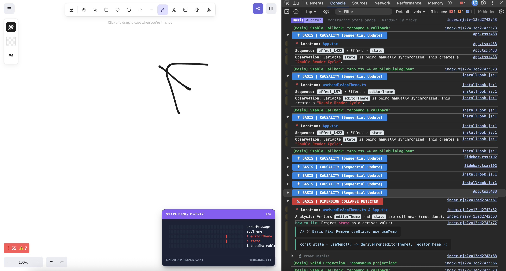
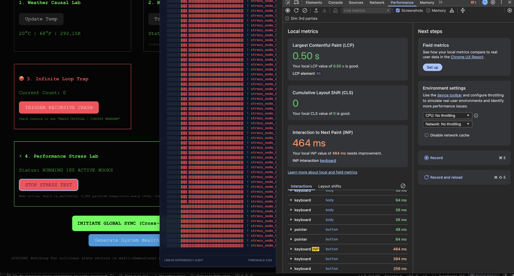

<p align="center">
  
</p>

<div align="center">

# 📐 react-state-basis
### Runtime state profiler for React

[](https://www.npmjs.com/package/react-state-basis)
[](https://github.com/liovic/react-state-basis/stargazers)
[](https://opensource.org/licenses/MIT)

**Catches redundant state and update chains using temporal cross-correlation.**

</div>

---

## What Does It Do?

**react-state-basis** watches your React app in development and flags common architectural issues:

- **Redundant state** - Two states that always update together
- **Update chains** - Effects that trigger more state updates (double renders)
- **Infinite loops** - Circular dependencies that freeze your browser
- **Tight coupling** - State variables that should be independent but aren't

It works by tracking *when* state updates happen (temporal patterns), not *what* the values are.

---

## Quick Example
```tsx
// ❌ Basis will flag this
const [user, setUser] = useState(null);
const [isLoggedIn, setIsLoggedIn] = useState(false);

useEffect(() => {
  setIsLoggedIn(!!user);  // Double render - flagged as sync leak
}, [user]);

// ✅ Better
const [user, setUser] = useState(null);
const isLoggedIn = !!user;  // Computed, no second render
```

---

## See It Work

The optional HUD shows your state basis matrix in real-time:

<p align="center">
  
</p>

---

## Real-World Audits

Basis has been tested on major open-source projects to validate detection accuracy:

### Excalidraw (114k+ ⭐)
**Detected:** Causal Sync Leak in theme state synchronization  
**Issue:** A `useEffect` was manually syncing theme state, causing an unnecessary double render on every theme toggle  
**Fix:** [PR #10637](https://github.com/excalidraw/excalidraw/pull/10637) - Replaced with a computed value

<p align="center"> 
   
</p>

### shadcn-admin (10k+ ⭐)
**Detected:** Redundant state pattern in mobile detection hooks  
**Issue:** Viewport resize events were being synchronized via effects rather than direct subscriptions  
**Fix:** [PR #274](https://github.com/satnaing/shadcn-admin/pull/274) - Optimized subscription pattern

<p align="center"> 
   
</p>

> **Note:** These are proposed architectural improvements. Basis points out patterns worth investigating - the final decision rests with the maintainer.

---

## Setup (Vite)

### 1. Install
```bash
npm i react-state-basis
```

### 2. Add to `vite.config.ts`
```tsx
import { defineConfig } from 'vite';
import react from '@vitejs/plugin-react';
import { basis } from 'react-state-basis/vite';

export default defineConfig({
  plugins: [
    react({
      babel: { plugins: [['react-state-basis/plugin']] }
    }),
    basis()
  ]
});
```

### 3. Wrap your app
```tsx
import { BasisProvider } from 'react-state-basis';

root.render(
  <BasisProvider debug={true}>
    <App />
  </BasisProvider>
);
```

### 4. Verify It's Working

Add this test pattern to any component:
```tsx
const [a, setA] = useState(0);
const [b, setB] = useState(0);

useEffect(() => {
  setB(a); // Basis will flag this
}, [a]);
```

Trigger an update (e.g., click a button that calls `setA(1)`). You should see a console alert within ~100ms.

---

## What You'll See

### Console Alerts

**Redundant Pattern:**
Detected when two variables move in perfect unison.
```
📐 BASIS | REDUNDANT PATTERN
📍 Location: TodoList.tsx
Observation: "todos" and "count" move together.
One is likely a direct mirror of the other. Confidence: 94%
Action: Refactor "count" to useMemo.
```

**Sync Leak (Causal Chain):**
Detected when one variable consistently triggers another with a temporal lag.
```
💡 BASIS | DETECTED SYNC LEAK
📍 Location: AuthProvider.tsx
Flow: user ➔ Effect ➔ isLoggedIn
Context: The engine detected a consistent 20ms lag between these updates.
Result: This creates a Double Render Cycle.
```

**Infinite Loop:**
Detected when a variable updates too rapidly (circuit breaker).
```
🛑 BASIS CRITICAL | CIRCUIT BREAKER
Infinite oscillation detected on: "counter"
Execution halted to prevent browser thread lock.
```

### Health Report

Check your entire app's state architecture:
```tsx
window.printBasisReport();
```

Shows:
- **Health Score** - Percentage of independent vs. synchronized state
- **Synchronized Clusters** - Groups of variables that move together
- **Correlation Matrix** - Full pairwise similarity analysis (for <15 variables)

---

## How It Works (v0.4.0)

### Temporal Cross-Correlation

Basis tracks **when** state updates occur, creating a 50-tick timeline for each variable:
```
useState("count"): [0,0,1,0,0,1,1,0,...]  (updates at ticks 2, 5, 6)
useState("total"): [0,0,1,0,0,1,1,0,...]  (same pattern)
                    ↑ Redundant: identical temporal signature
```

For every pair of variables, Basis checks three temporal relationships:

1. **Synchronous (Redundancy):** Do they update in the same tick?
```
   A: [0,1,0,1,0,...]
   B: [0,1,0,1,0,...]  → Flagged as redundant
```

2. **Lead-Lag (A → B):** Does B consistently follow A in the next tick?
```
   A: [0,1,0,1,0,...]
   B: [0,0,1,0,1,...]  → B follows A (sync leak detected)
```

3. **Lead-Lag (B → A):** Does A consistently follow B?
```
   A: [0,0,1,0,1,...]
   B: [0,1,0,1,0,...]  → A follows B (reverse causality)
```

The engine uses **offset-based comparison** to check these patterns without allocating temporary arrays, ensuring minimal overhead even at high frame rates.

### Performance Optimizations

- **Idle Filtering:** Only analyzes variables with 2+ updates, reducing pairwise comparisons by ~90% in typical applications (measured on Excalidraw's 47-hook codebase)
- **Batched Analysis:** Runs every 5 ticks (~100ms) to avoid impacting frame budget
- **Console Throttling:** Same alert won't repeat within 5 seconds
- **Zero Production Overhead:** Entire library is replaced with no-op shims in production builds

### What Gets Flagged?

**Redundant Pattern Example:**
```tsx
// ❌ Before (Basis flags this)
const [count, setCount] = useState(0);
const [doubled, setDoubled] = useState(0);

useEffect(() => {
  setDoubled(count * 2);
}, [count]);

// ✅ After (Basis suggestion)
const [count, setCount] = useState(0);
const doubled = useMemo(() => count * 2, [count]);
```

**Sync Leak Example:**
```tsx
// ❌ Before (causes double render)
const [user, setUser] = useState(null);
const [isLoggedIn, setIsLoggedIn] = useState(false);

useEffect(() => {
  setIsLoggedIn(!!user);
}, [user]);

// ✅ After (single render)
const [user, setUser] = useState(null);
const isLoggedIn = !!user; // Derived, no effect needed
```

---

## Upgrading from v0.3.x

### Breaking Changes
None! v0.4.0 is a drop-in replacement.

### What's Different
- **Better Detection:** Temporal analysis reduces false positives by distinguishing redundancy from causality
- **New Alert Type:** "DETECTED SYNC LEAK" identifies effect-driven update chains with directional insight
- **Console Throttling:** Same pair won't spam console (5-second cooldown between identical alerts)
- **Idle Filtering:** Variables that haven't updated are excluded from analysis

### Action Required
None. Just update the package and restart your dev server.
```bash
npm update react-state-basis
```

---

## Production Safety

In production builds, the entire tool is replaced with zero-op shims. **Zero runtime overhead. Zero bundle size increase.**
```json
// package.json - automatic based on NODE_ENV
"exports": {
  ".": {
    "development": "./dist/index.mjs",
    "production": "./dist/production.mjs",  // No-op shims
    "default": "./dist/production.mjs"
  }
}
```

---

## When to Skip Files

Add `// @basis-ignore` at the top of a file to disable instrumentation:
```tsx
// @basis-ignore
// This file uses high-frequency animations and intentional state synchronization
```

**Good candidates for skipping:**
- **High-frequency animations** (>60fps state updates)
- **WebSocket message handlers** (rapid, intentional updates)
- **Canvas/WebGL render loops** (performance-critical paths)
- **Intentional synchronization** (e.g., React Query → local cache mirrors)
- **Third-party library wrappers** (where you don't control the architecture)

---

## Comparison to Other Tools

| Tool | Focus | When to Use |
|------|-------|-------------|
| **React DevTools** | Component hierarchy & values | Debugging specific components |
| **Why Did You Render** | Re-render optimization | Performance tuning renders |
| **ESLint exhaustive-deps** | Static dependency analysis | Preventing missing deps |
| **react-state-basis** | **Temporal state relationships** | **Finding redundant state & effect chains** |

These tools are complementary - use them together for best results.

---

## Performance Impact (Measured)

**Development Mode**

These measurements were taken using the built-in **Stress Lab** with 100 active hooks and continuous state updates, observed in Chrome DevTools Performance and Web Vitals panels. 

Location: `/example`

**Observed impact:**

* **Per state update overhead:** ~0.3ms (lightweight hook instrumentation)
* **Analysis pass (every ~100ms / 5 ticks):** ~2–4ms in typical applications
* **Frame budget impact:** <1% when idle, ~5–10% during active stress testing
* **Render path safety:** Analysis runs asynchronously, outside of React’s render cycle

> Results will vary by hardware, browser, and workload. Use the Stress Lab to reproduce and compare Basis ON vs OFF in your own environment.

<p align="center"> 
   
</p>


**Production Mode:**
- Overhead: ~0.01ms per hook call (negligible wrapper overhead)
- Bundle size: ~2-3 KB minified (no-op wrappers only, no analysis engine)
- Monitoring logic: 100% removed
- HUD component: 100% removed

---

## Limitations (v0.4.0)

**What works well:**
- ✅ Detecting synchronous redundant state
- ✅ Flagging effect-driven update chains (A → Effect → B)
- ✅ Catching infinite loops before browser freeze
- ✅ Distinguishing causality from redundancy

**Known edge cases:**
- ⚠️ **Async gaps:** Updates delayed by >40ms (e.g., slow API responses) may appear independent
- ⚠️ **Intentional sync:** Sometimes synchronization is required for library compatibility
- ⚠️ **Complex multi-way dependencies:** Three or more interconnected states might not show full relationship graph
- ⚠️ **Requires judgment:** Tool points out patterns worth investigating - you decide if they're issues

**False positives can happen.** Always verify before refactoring.

---

## Roadmap

### v0.4.x
- [x] **v0.4.0**: Temporal Cross-Correlation Engine (Lead-Lag Analysis)
- [ ] v0.4.1: Density Filtering (Eliminate false positives from animations/sliders)
- [ ] v0.4.2: Ring Buffer (Zero-jank memory management for 500+ hooks)
- [ ] v0.4.3: Custom Sensitivity (#23) 

### v0.5.0 (Planned)
- [ ] Zustand & Redux middleware integration
- [ ] Visual dependency graph in HUD
- [ ] Historical trend tracking across sessions

### Future Ideas
- [ ] Domain isolation analysis (detect feature boundaries)
- [ ] Export audit reports for team reviews
- [ ] CI integration for architectural regressions

---

## Troubleshooting

**"I'm not seeing any alerts"**
1. Verify `debug={true}` is set in `<BasisProvider>`
2. Check that the Babel plugin is loaded (restart dev server after config changes)
3. Create a test pattern (see "Verify It's Working" section)
4. Open browser console and look for `Basis Auditor | Structural Relationship Check`

**"Too many alerts"**
- Use `// @basis-ignore` for animation-heavy files
- Check if your app has intentional state synchronization patterns
- Consider if alerts are revealing actual architectural issues

**"Alert says 'sync leak' but I need that effect"**
- Some effects are necessary (e.g., syncing to localStorage)
- Basis flags patterns, not bugs - use your judgment
- If it's intentional, add a comment explaining why

---

## FAQ

**Q: Will this slow down my app?**  
A: Only in development (~0.3ms per update). Production builds have zero overhead.

**Q: Do I have to change my code?**  
A: No. The Babel plugin instruments hooks automatically.

**Q: What if it flags something that's not a problem?**  
A: Use your judgment. Basis is a diagnostic tool that points out patterns worth investigating - not all flagged patterns are bugs.

**Q: How is this different from Redux DevTools?**  
A: Redux DevTools shows state values and action history. Basis shows temporal relationships between state variables, regardless of what state management library you use.

**Q: Why "basis"?**  
A: In linear algebra, a "basis" is a minimal set of independent vectors. The name reflects the goal of finding your app's minimal independent state - removing redundancy.

**Q: How is this different from Redux DevTools?**  
A: Redux DevTools is a **Journal** - it logs specific values and actions within a Redux store. Basis is an **Architectural Auditor** - it instruments React's core primitives (useState, useReducer, useEffect) to detect hidden relationships between entirely separate components and hooks, even when they don't share a store. Redux DevTools answers "what changed and why?" while Basis answers "is this state architecture clean?"

---

## Contributing

Found a bug? Have an idea? Open an issue or PR.

For technical details on how the detection works, see the [Wiki](https://github.com/liovic/react-state-basis/wiki).

---

<div align="center">

Built by [LP](https://github.com/liovic) • MIT License

</div>