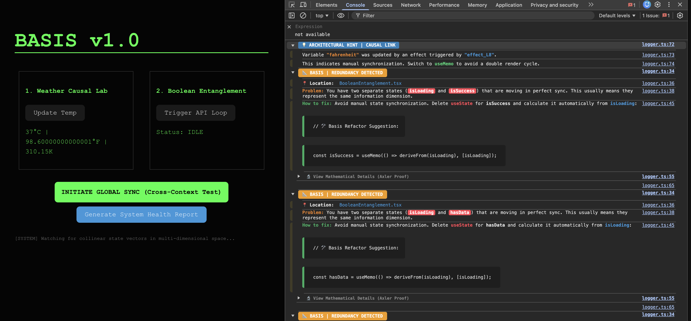
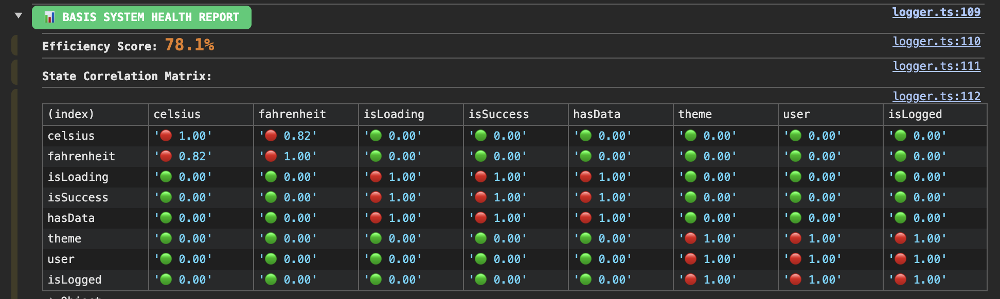

# 📐 REACT-BASIS
### **Behavioral State Analysis for React**

It observes how state variables change over time to identify strong correlations that indicate architectural redundancy.

**React-basis** is a real-time architectural auditing engine that treats a React application as a **dynamic system of discrete-time vectors**. Instead of static linting, which only analyzes syntax, Basis monitors the **State Space Topology** of your application to detect mathematical redundancy (collinearity) and synchronization anti-patterns in real-time.

Inspired by the work of **Sheldon Axler** (*"Linear Algebra Done Right"*), Basis aims to enforce a mathematically optimal "Source of Truth" by ensuring your application state forms a **Basis**.

---

## 🧠 The Philosophy: State as a Vector Space

In a perfectly architected application, every state variable should represent a **unique dimension of information**. 

Mathematically, your state variables $\{v_1, v_2, \dots, v_n\}$ should form a **Basis** for your application's state space $V$. A Basis must be **linearly independent**. If two variables update in perfect synchronization, they are **collinear** (linearly dependent). This creates:
1.  **Redundant Renders:** Multiple cycles for a single logical change.
2.  **State Desynchronization:** High risk of "impossible states" (e.g., `user` exists but `isLoggedIn` is false).
3.  **Architectural Entropy:** High cognitive load in tracing data causality.

---
## 🚀 See It In Action





Try the full interactive demo here: [/example](./example)

---

## 🚀 Setup & Integration

To enable the mathematical monitoring of your application, follow these two steps:

### 1. Initialize the Basis Monitor
Wrap your application root (e.g., `main.tsx` or `App.tsx`) with the `BasisProvider`. Setting `debug={true}` enables the real-time diagnostic dashboard and the visual system status monitor.

```tsx
import { BasisProvider } from 'react-basis';

export default function Root() {
  return (
    <BasisProvider debug={true}>
       <App />
    </BasisProvider>
  );
}
```

### 2. Use Drop-in Replacement Imports
Replace your standard React hook imports with `react-basis`. This allows the engine to instrument your state updates without changing your component logic.

```tsx
// ❌ Change this:
// import { useState, useEffect } from 'react';

// ✅ To this:
import { useState, useEffect, useMemo, useContext } from 'react-basis';

function MyComponent() {
  const [data, setData] = useState([]); // Automatically vectorized and tracked
}
```

> Note: React-Basis includes an optional Babel plugin that automatically labels state variables for richer diagnostics.


---

## 🕵️‍♂️ Technical Architecture

Basis utilizes a three-tier instrumentation pipeline to audit your system:

### 1. The Compiler Layer (Babel AST)
A build-time plugin performs static analysis, injecting the **filename** and **variable name** directly into the runtime calls. This transforms an anonymous execution graph into a **structured state map**.

### 2. The Runtime Layer (Signal Mapping)
Every state transition is intercepted. Basis groups updates occurring within a **16ms window** into a single "System Tick." Each state variable is mapped to a vector in $\mathbb{R}^{50}$.
*   `1` = State transition occurred in this tick.
*   `0` = State remained stagnant.

### 3. The Analysis Layer (The Heuristic)
In pure Linear Algebra, proving linear independence for $N$ variables requires solving the system $a_1v_1 + \dots + a_nv_n = 0$. Using algorithms like Gaussian elimination or SVD to determine the **Rank** of the state matrix has a computational complexity of $O(N^3)$. Running this in a browser runtime for every state update would be prohibitively expensive.

To maintain real-time performance, React-Basis uses **Cosine Similarity** as a high-speed heuristic ($O(D)$, where $D$ is the vector dimension) to detect **pairwise collinearity**:

$$ \text{similarity} = \cos(\theta) = \frac{\mathbf{A} \cdot \mathbf{B}}{\Vert \mathbf{A} \Vert \Vert \mathbf{B} \Vert} $$

If $\cos(\theta) \approx 1.00$, the vectors are collinear (linearly dependent), and the engine triggers a redundancy alert.

---

## 📝 Real-World Demonstration: The Auth Anti-Pattern

Developers often manually sync related states, creating a redundant dimension in the Basis:

### ❌ Redundant Basis (State Bloat)
```tsx
const [user, setUser] = useState(null);
const [isLogged, setIsLogged] = useState(false);

const onLogin = (userData) => {
  setUser(userData);
  setIsLogged(true); // ⚠️ BASIS ALERT: Always updated in sync with 'user'
};
```
**Engine Analysis:** The Engine calculates that `user` and `isLogged` are perfectly synchronized. It warns you that you are using two dimensions to describe a 1D problem.

### ✅ Independent Basis (Optimal Design)
Basis suggests a **Projection**-transforming a basis vector into a derived value.
```tsx
const [user, setUser] = useState(null); 
const isLogged = useMemo(() => !!user, [user]); // Mathematically clean
```

---

## 🖥️ Diagnostic Dashboard

Basis provides high-end diagnostic feedback directly in your browser console:

*   **📍 Location Tracking:** Identifies exact files and variable names causing redundancy.
*   **🛠️ Refactor Snippets:** Provides dark-themed code blocks you can copy-paste to fix your state architecture.
*   **📊 Health Matrix:** Call `printBasisReport()` to see your **Efficiency Score** and the full **Correlation Matrix** of your application.

---

## ✨ Key Features

*   **🕵️‍♂️ Content-Agnostic:** Identifies logical links through temporal synchronization, not data types.
*   **🛡️ Circuit Breaker:** Halts high-frequency state oscillations (Infinite Loops) to protect the browser thread.
*   **💡 Causal Detective:** Tracks causality chains from `useEffect` to `useState` to identify cascading renders.
*   **🔄 Zero Lock-in:** Simply point your imports back to `'react'` in production. Basis is a **Development-time verification infrastructure**.

---

## 🎓 Mathematical Inspiration

### 📜 The Basis Theorem
According to Axler (*Linear Algebra Done Right, Definition 2.27*):

> A **basis** of $V$ is a list of vectors in $V$ that is **linearly independent** and **spans** $V$.

To satisfy this theorem in the context of application state:

1.  **Linear Independence:** No state variable in the list can be expressed as a linear combination of the others. If a state $v_n$ can be derived from $\{v_1, \dots, v_{n-1}\}$, the list is linearly dependent and contains redundancy.
2.  **Spanning the Space:** The list of state variables must contain enough information to represent every possible configuration of the user interface.

React-Basis ensures that your state list is a true Basis by identifying and flagging vectors that fail the test of linear independence.

> *"Linear algebra is the study of linear maps on finite-dimensional vector spaces."*  
> - **Sheldon Axler**

React-Basis bridges the gap between abstract algebra and UI engineering.
By ensuring your application state forms an independent, non-redundant basis, it helps you build software that is inherently more stable, efficient, and easier to reason about.
---

### 📜 Implementation of the Linear Dependency Lemma
According to Axler (*Lemma 2.21*), in a linearly dependent **list** of vectors, there exists an index $j$ such that $v_j$ is in the span of the **preceding** vectors ($v_1, \dots, v_{j-1}$).

**React-Basis** implements this sequential logic to audit your state:

1.  **The Ordered List:** Every state variable is treated as an element in an ordered list $(v_1, v_2, \dots, v_n)$ based on its registration order in the application.
2.  **Sequential Discovery:** As time progresses, the engine monitors the list. It doesn't just look for "similar" vectors; it looks for vectors that **fail to add a new dimension** to the subspace generated by the vectors that came before them.
3.  **Identifying the Redundant Element:** If $v_{isLogged}$ is perfectly correlated with $v_{user}$, the engine identifies that $v_{isLogged} \in \text{span}(v_{user})$. Since $v_{user}$ preceded it, $v_{isLogged}$ is mathematically the redundant element.
4.  **Basis Reduction:** Following the lemma's second conclusion, the engine advises removing $v_j$, proving that the "information span" of your app remains identical while the complexity of the Basis decreases.

---

## ⚠️ Design Constraints & Heuristics

React-Basis uses probabilistic, time-windowed heuristics to approximate linear dependence.
As with any runtime analysis:

- Rarely-updated states may appear correlated by chance
- High-frequency UI interactions may trigger conservative warnings
- Results are advisory, not prescriptive

React-Basis is designed to **surface architectural questions**, not enforce correctness.

---

## ❓ Frequently Asked Questions

### **Is React-Basis a replacement for React DevTools or linters?**
No.

React-Basis complements existing tools.  
Linters analyze **code structure**, and React DevTools show **component behavior**. React-Basis analyzes **state relationships over time**-something neither tool is designed to detect.

It answers questions like:
- *“Why do these two states always change together?”*
- *“Which state is the true source of truth?”*
- *“Am I manually synchronizing derived data?”*

---

### **Does this change React behavior or execution order?**
No.

React-Basis **does not modify React’s scheduling, rendering, or reconciliation**.  
It observes state updates at runtime and logs diagnostics during development.

Removing React-Basis restores your application to standard React behavior with no residual effects.

---

### **Is this safe to use in production?**
React-Basis is designed for **development-time analysis**.

While it is technically safe to run in production, it:
- adds runtime overhead
- logs diagnostic output
- performs continuous analysis

For production builds, simply switch your imports back to `'react'`.

---

### **How accurate is the redundancy detection?**
React-Basis uses **time-windowed behavioral analysis**, not formal proofs.

This means:
- Strong, consistent correlations are highly reliable indicators of redundancy
- Rare or coincidental correlations may trigger conservative warnings

All results are **advisory** and should be interpreted as architectural signals, not errors.

---

### **Can this detect all redundant state?**
No-and that’s intentional.

React-Basis detects **behavioral redundancy**, not semantic equivalence.  
Two states may contain the same *data* but update independently, which is architecturally valid.

React-Basis only flags redundancy when two states behave as a single information dimension over time.

---

### **Why not just use selectors or derived state manually?**
You should-and React-Basis encourages that.

The challenge is *finding* where derived state should exist in large or evolving codebases. React-Basis helps identify:
- state that should be derived
- state that is unintentionally synchronized
- state that adds no new information

It surfaces opportunities for refactoring, not rules you must follow.

---

### **Does this work with Redux, Zustand, or other state managers?**
React-Basis currently instruments **React hooks directly**.

However, the underlying model is store-agnostic. Any system with:
- discrete state updates
- identifiable update points
- consistent labeling

could theoretically be analyzed using the same approach.

---

### **What about performance?**
React-Basis is optimized for real-time use in development.

Key design choices:
- Fixed-size sliding windows
- O(D) similarity checks
- Batched analysis every N ticks

For typical applications, overhead is negligible. For extremely high-frequency updates (e.g., animations), React-Basis may emit conservative warnings.

---

### **Is this “formal verification”?**
No.

React-Basis performs **runtime architectural auditing**, not formal mathematical verification.  
It applies concepts from linear algebra to **observe and analyze behavior**, not to prove correctness.

---

### **Who is this tool for?**
React-Basis is best suited for:
- Medium to large React applications
- Codebases with complex state interactions
- Engineers debugging synchronization bugs
- Teams prioritizing architectural clarity

It may be unnecessary for small or short-lived projects.

---

### **Why linear algebra?**
Because state redundancy *is* linear dependence.

If two state variables always change together, they span the same dimension of information. Linear algebra provides a precise language-and useful tools-for detecting and reasoning about that relationship.

---

### **Will this ever produce false positives?**
Yes.

React-Basis favors **visibility over silence**.  
When in doubt, it surfaces potential issues so developers can make informed decisions.

Think of it as an architectural smoke detector-not a fire marshal.


---
*Developed by LP*  
*For engineers who treat software as applied mathematics.* 🚀📐