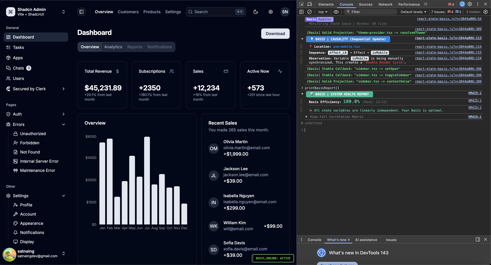

<p align="center">
  
</p>

<div align="center">

# 📐 react-state-basis
### Real-time architectural auditor for React

[](https://www.npmjs.com/package/react-state-basis)
[](https://github.com/liovic/react-state-basis/stargazers)
[](https://opensource.org/licenses/MIT)

**Audit your React architecture in development — without changing a single line of component code.**

</div>

---

## What is react-state-basis?

**react-state-basis** is a development-time React utility that analyzes how state behaves *over time* and surfaces architectural issues that are difficult to detect with snapshot-based tools.

It focuses on **runtime behavior**, not values — helping you identify redundant state, hidden coupling, unstable update patterns, and effect-driven render loops while your app is running.

> This is an architectural diagnostic tool.  
> It is not a state manager and not a replacement for React DevTools.

---

## What problems does it catch?

In real React applications, many architectural issues don’t show up as errors:

- Multiple state variables encode the same information
- Effects create subtle feedback loops
- Components re-render twice even though nothing “looks wrong”
- State updates oscillate under load or user interaction

These issues emerge **over time**, across renders.

react-state-basis observes state updates as a timeline and flags structural patterns that indicate architectural debt.

---

## Key capabilities

- **Temporal State Matrix (HUD)**  
  A real-time visualization of state activity. If rows pulse together, the architecture is coupled or redundant.

- **Redundant state detection**  
  Identifies state variables that move together and suggests derived alternatives (e.g. `useMemo`).

- **Causality tracing**  
  Tracks `useEffect → setState` chains to expose hidden double-render cycles.

- **Stability circuit breaker**  
  Detects recursive update patterns and halts them before the browser tab locks up.

- **Universal support**  
  Works with **React Web**, **React Native**, and **Expo**.

---

## High-Level Insights

### System Health Report
For a bird's-eye view of your entire application's state-space, call the global reporter in your browser console or in code :

```tsx
window.printBasisReport();
```

This generates a correlation matrix and calculates your Basis Efficiency Score in real-time.

---

## How it works (high level)

During development, react-state-basis observes state updates and compares how they evolve over short time windows.

Instead of asking:
> “What is the state right now?”

It asks:
> “How does this state behave relative to other states over time?”

This allows the engine to detect redundancy, coupling, and instability that static analysis and snapshot tools can’t see.

Implementation details are intentionally hidden from the public API.  
The tool is designed to be **used**, not configured.

👉 For a deeper dive into the internal model and formal specification, see the [project Wiki](https://github.com/liovic/react-state-basis/wiki).

---

## See it in action

The optional HUD visualizes your application’s state “heartbeat” using the Canvas API.

Below, Basis detects redundant state, flags effect-driven render loops, and activates the stability circuit breaker in real time.

<p align="center">
  
</p>

---

## Zero-friction setup (Vite)

As of **v0.3.0**, react-state-basis runs transparently in development.

You do **not** need to modify component imports or wrap individual hooks.

### 1. Install
```bash
npm i react-state-basis
```

### 2. Configure Vite

Add the `basis` plugin to your `vite.config.ts`.
It instruments React automatically during development.

```tsx
import { defineConfig } from 'vite';
import react from '@vitejs/plugin-react';
import { basis } from 'react-state-basis/vite';

export default defineConfig({
  plugins: [
    react({
      babel: { plugins: [['react-state-basis/plugin']] }
    }),
    basis() // No import changes required
  ]
});
```

### 3. Initialize the provider

Wrap your root component with `BasisProvider` to enable the engine and HUD.

```tsx
import { BasisProvider } from 'react-state-basis';

root.render(
  <BasisProvider debug={true}>
    <App />
  </BasisProvider>
);
```

### Ignoring files

If certain files are intentionally noisy (e.g. animation loops or low-level adapters), you can exclude them from auditing.

Add this comment at the top of the file:

```tsx
// @basis-ignore
```

That file will be skipped by both the Babel plugin and the engine.

---

## Basis vs existing tools

| Feature | React DevTools | Why Did You Render | Basis 📐 |
| :--- | :---: | :---: | :---: |
| **Analyzes Values** | ✅ | ✅ | ❌ (Value-agnostic) |
| **Tracks Timing/Ticks** | ❌ | ❌ | ✅ |
| **Detects Redundancy** | ❌ | ❌ | ✅ (Linear Dependence) |
| **Circuit Breaker** | ❌ | ❌ | ✅ (Halts Loops) |
| **Prod. Overhead** | Low | Medium | **Zero** (Ghost Mode) |

---

## Case study: shadcn-admin audit

We ran react-state-basis on a production-ready dashboard to validate its detection engine.
- Result: 12 / 12 independent state dimensions
- Insight: Identified a subtle double-render bottleneck in useIsMobile that static tooling missed


<p align="center">  </p>

---

## Roadmap

#### **v0.2.x - Signal Intelligence & Visual Foundation (Current)** ✅
- [x] **Full React Hook Parity:** Support for all standard hooks and React Native/Expo.
- [x] **React 19 Ready:** Full support for `use()`, `useOptimistic()`, and `useActionState()`.
- [x] **Temporal Matrix HUD:** Real-time Canvas-based visualization of state signals.
- [x] **Causality Engine:** Detection of sequential sync-leaks and double-render cycles.
- [x] **Ghost Mode:** Zero-op production exports with no bundle overhead.
- [x] **95% Test Coverage:** Verified mathematical engine.

#### **v0.3.0 - Global State & Ecosystem**
- [x] **Zero-Config Vite Plugin:** Automatic aliasing for `react` and `react-dom`.
- [x] **Babel Auto-Instrumentation:** Automatic hook labeling without code changes.
- [ ] **Zustand Middleware:** Auditing global-to-local state redundancy.
- [ ] **Redux Integration:** Connecting the causal engine to Redux dispatch cycles.
- [ ] **CLI Initializer:** `rsb-init` to automatically configure Babel/Vite plugins.
- [ ] **Context Auditor:** Tracking signal collisions across multiple React Context providers.

#### **v0.4.0 - Topology & Automation**
- [ ] **State-Space Topology Map:** 2D force-directed graph showing coupling clusters.
- [ ] **Automated Fix Hints:** Advanced console codemods for converting redundant state to `useMemo`.

---


<div align="center"> Developed by LP • A React utility for engineers who care about architectural correctness </div>